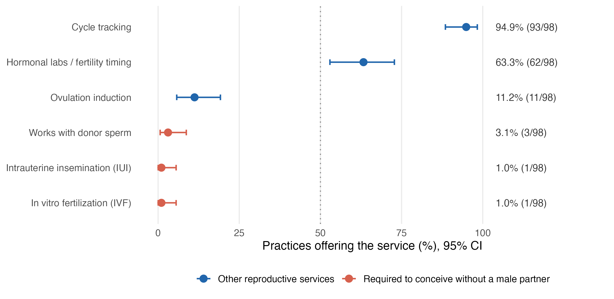
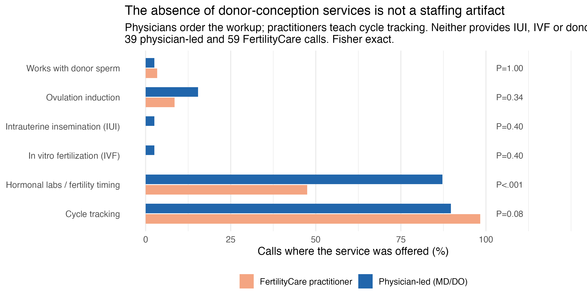
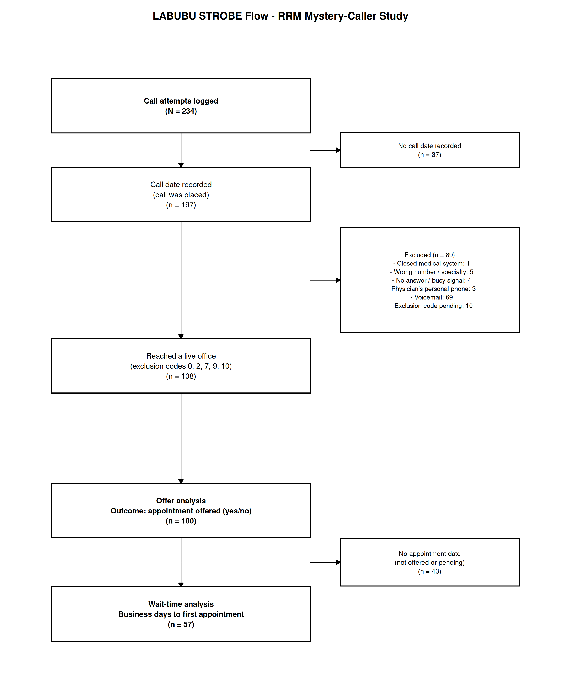
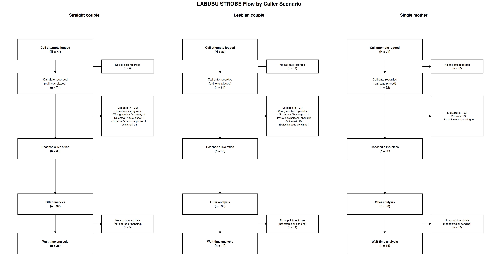
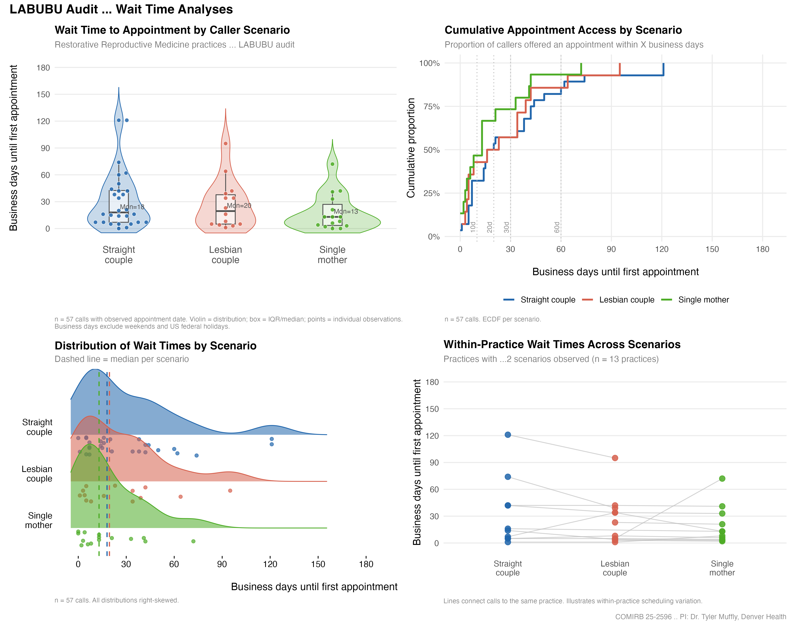

# LABUBU — Mystery-Caller Study of Restorative Reproductive Medicine Practices

[](https://comirb.ucdenver.edu)
[](https://redcap.ucdenver.edu)
[](https://www.r-project.org/)
[](https://github.com/mufflyt/mysterycall)
[](https://github.com/mufflyt/LABUBU/actions/workflows/nightly.yml)
[](https://github.com/mufflyt/LABUBU/actions/workflows/data-validation.yml)
[](https://github.com/mufflyt/LABUBU/actions/workflows/render-manuscript.yml)
[](PROVENANCE.md)

Secret-shopper (audit) study of Restorative Reproductive Medicine (RRM) practices across the United States. Each practice is called once per **scenario** — *straight couple*, *lesbian couple*, *single mother using donor sperm* — to evaluate whether appointment access and business-day wait times differ by caller identity.

> **On the primary outcome.** The data-collection instrument never asked whether staff agreed to schedule the caller, so the outcome is **appointment availability inferred from call documentation**, not a measured "offer". Strict and broad definitions give materially different effect sizes (triad OR 0.04 vs 0.31); direction is the defensible claim, magnitude should not be quoted without its definition. See [`docs/OPEN-DECISIONS.md`](docs/OPEN-DECISIONS.md).

- **Study Design:** Within-practice paired comparison (practice entered as random intercept).
- **Principal Investigator:** Dr. Tyler Muffly, MD (Denver Health / University of Colorado).
- **Data Source:** REDCap project **pid 39546** (`redcap.ucdenver.edu`).
- **Modeling Engine:** [`mysterycall`](https://github.com/mufflyt/mysterycall) R package (external statistical engine).

---

## 🖼️ Figures

### The service menu — the study's primary finding



Cycle tracking is offered by 94.9% of practices reached. Intrauterine
insemination and in vitro fertilization are each offered by **one practice out
of 98**, and donor sperm by three. The services shown in red are those a patient
needs to conceive without a male partner, and they are essentially absent from
the RRM menu.

This is a structural property of the model of care, not a finding about how
staff treat anyone: it does not depend on which caller placed the call, and it
is measured directly rather than derived. Intervals are Wilson score intervals,
the same ones in Appendix Table S3 — the figure and that table are checked
against each other by `figures/plotted-values-match-tables`.

### Is it just a staffing artifact?



RRM practices are not one kind of provider. Of 105 practices, 30 name a
physician (MD or DO); the rest are largely FertilityCare centres staffed by
Creighton Model practitioners, who hold a certificate in fertility-awareness
instruction rather than a medical licence.

That invites the strongest objection available to the finding above: *of course
a cycle-tracking educator does not offer IVF, so pooling the two groups
manufactures the absence.*

**It does not.** Among the 39 interviewed calls to physician-led practices, IUI
and IVF were each offered by **one** (2.6%, 95% CI 0.5 to 13.2), against **zero
of 59** FertilityCare calls. The single practice offering IUI also offered IVF
and worked with donor sperm, and was physician-led. It is the only practice in
the sample providing the full donor-conception pathway.

The stratification does reveal the division of labour it was built to test, and
it is the cleanest contrast in the study: hormonal laboratory monitoring 87.2%
against 47.5% (**P<.001**), with cycle tracking near-universal in both.
Physicians perform the workup and practitioners teach cycle tracking, exactly as
the model describes. What neither provides is donor conception.

Practitioner type is classified from credential tokens in the practice name and
never from the services reported;
`stratum/practitioner-type-not-derived-from-outcomes` fails the build if that
changes. The misclassification that remains runs in one direction only: a
FertilityCare centre employing an unnamed physician is counted as
non-physician, which can only raise that stratum's apparent rates.

### Cohort flow



234 calls placed → 108 reached a live office → 100 eligible for the offer
analysis → 57 with an observed appointment date.

### Flow by caller scenario



The three arms enter the funnel at comparable widths and leave at very
different ones — 39/37/32 reached, but 28/14/15 reaching the wait analysis.
That asymmetry is real, but it is **not** the study's finding. Documentation
completeness differs by arm in the same direction (appointment date missing for
28.2% / 62.2% / 53.1% of reached calls), so differential documentation and
differential availability cannot be separated. Read this figure alongside
Appendix Table S2, and treat the scenario comparison as exploratory.

### Validation, in one picture

The repository does not ask you to trust a green badge. `mutation_report.csv`
records six deliberately broken versions of the analysis and which check caught
each one:

| Mutant | Caught by |
|---|---|
| MDE computed at α = .50 | `crosscheck/mde-attains-claimed-power` |
| MDE from a normal approximation | `crosscheck/mde-attains-claimed-power` |
| Wilson intervals replaced by Wald | `crosscheck/wilson-intervals` |
| Business days off by one | `crosscheck/business-days` |
| Practice grouping keyed on raw text | `metamorphic/practice-name-invariant` |
| Duplicate cell resolved by row order | `metamorphic/make-wide-order-invariant` |

Six mutants, six killed, zero survivors.

### Wait time to first available appointment



Raincloud, ridgeline, ECDF and within-practice pairs. **All four are built on
the wait subset (n = 57)** — calls where an appointment date was recorded,
which is 24% of calls placed and scenario-dependent (28 straight, 14 lesbian,
15 single mother). They describe the practices that gave a date, not the study
population.

---

## ⚡ Quick Start (One-Command Refresh)

The primary entry point for this repository is **`refresh.R`**. When a new export lands or prior to running reports, execute a single command from the repository root:

```sh
# Option A: Auto-detect newest export in ~/Downloads or repo root
Rscript refresh.R

# Option B: Pull directly from REDCap API (requires REDCAP_LABUBU_TOKEN in ~/.Renviron)
Rscript refresh.R --pull
```

`refresh.R` automatically:
1. Copies the latest REDCap LABELS export into the repository root.
2. Archives superseded raw exports to `Old_redcap/`.
3. Executes full cleaning and statistical modeling via `evaluate_labubu_mysterycall.R`.
4. Renders all 5 high-resolution wait-time figures via `figures_wait_time.R`.
5. Updates cryptographic fingerprints and audit trail in `PROVENANCE.md` via `provenance.R`.
6. Prints a concise before/after delta of records, completed triads, missing calls, and name warnings.

To check call progress without triggering a full model re-run:
```sh
Rscript call_progress.R
```

---

## 📊 Provenance & Denominator Cascade

> [!IMPORTANT]
> Every figure, table, and report in `mysterycall_outputs/` is cryptographically fingerprinted in **[`PROVENANCE.md`](PROVENANCE.md)** — including input file MD5 checksums, git commit hashes, package versions, creation timestamps, and exact sample sizes. `PROVENANCE.md` is **generated automatically by `provenance.R` and must never be edited manually**.

Before quoting sample sizes (*n*) in a manuscript, abstract, or presentation, consult the **Denominator Cascade**:

| Level | Rule / Inclusion Criteria | Primary Usage |
|---|---|---|
| `all_records` | Every row present in the REDCap export | Gross export record counts only |
| `analytic_inclusion` | Contacted & eligible calls (`Reason for exclusions == "Included..."`) | Acceptance models, service mix descriptives |
| `wait_subset` | Included **and** achieved an observed, valid appointment date | Wait-time distributions (Figs 1–3, LMM model) |
| `within_practice_pairs` | Wait subset restricted to practices called under $\ge 2$ scenarios | Within-practice paired analyses (Fig 4) |

> [!WARNING]
> **No figure uses the total record count.** Quoting the total record count under a wait-time figure overstates that figure's effective sample by approximately **4x**. Live values are maintained in `PROVENANCE.md`.

---

## 🔄 End-to-End Pipeline Architecture

```
                       ┌─────────────────────────┐
                       │  REDCap PID 39546 API   │
                       └────────────┬────────────┘
                                    │ redcap_pull.R (or manual CSV export)
                                    ▼
                       ┌─────────────────────────┐
                       │ LABUBU_DATA_LABELS_*.csv│  (gitignored)
                       └────────────┬────────────┘
                                    │
                                    │ refresh.R
                                    ▼
                  ┌───────────────────────────────────┐
                  │ evaluate_labubu_mysterycall.R     │ (uses mysterycall R pkg)
                  └─────────────────┬─────────────────┘
                                    │
         ┌──────────────────────────┼──────────────────────────┐
         ▼                          ▼                          ▼
┌─────────────────────────┐┌──────────────────┐┌─────────────────────────────────┐
│ mysterycall_outputs/    ││ figures_wait_    ││ mysterycall_evaluation.md       │
│ labubu_cleaned_analysis ││ time.R           ││ (Full Markdown evaluation)      │
│ + 15 result CSVs        │└────────┬─────────┘└─────────────────────────────────┘
└────────┬────────────────┘         │
         │                          ▼
         │                 ┌──────────────────┐
         │                 │ figures/*.png    │ (5 publication PNGs)
         │                 └────────┬─────────┘
         │                          │
         └──────────────────────────┼──────────────────────────┐
                                    ▼                          ▼
                           ┌──────────────────┐       ┌─────────────────┐
                           │ provenance.R     │       │ manuscript.Rmd  │
                           └────────┬─────────┘       └────────┬────────┘
                                    ▼                          ▼
                           ┌──────────────────┐       ┌─────────────────┐
                           │ PROVENANCE.md    │       │ manuscript.html │
                           │ provenance.json  │       └─────────────────┘
                           └──────────────────┘
```

---

## 🛠️ Repository Scripts & Tools

| Script | Purpose & Description |
|---|---|
| [`refresh.R`](refresh.R) | **One-command master orchestrator.** Handles export ingestion, archiving, execution, and delta reporting. |
| [`redcap_pull.R`](redcap_pull.R) | Downloads labelled and raw exports directly from the REDCap API token. |
| [`evaluate_labubu_mysterycall.R`](evaluate_labubu_mysterycall.R) | Core data cleaning, normalization, GLMER/LMM modeling, McNemar tests, and report generation. |
| [`figures_wait_time.R`](figures_wait_time.R) | Generates publication-ready figures (raincloud, ridge plot, ECDF, within-practice pairs, 2x2 panel). |
| [`provenance.R`](provenance.R) | Computes MD5 checksums, Git state, package versions, and denominator levels into `PROVENANCE.md`. |
| [`tools/reproduce.R`](tools/reproduce.R) | Rebuilds every artifact from the export `PROVENANCE.md` names and fails if any estimand moved. Use after a clean clone. |
| [`tools/reference_implementations.R`](tools/reference_implementations.R) | Wilson, Clopper-Pearson, exact McNemar, paired MDE, business days and ICC written from the published formulae. Never calls `mysterycall`. |
| [`call_progress.R`](call_progress.R) | Lightweight progress utility to count remaining single-mother calls and complete practice triads. |
| [`app.R`](app.R) | Interactive Shiny application for exploring practice-level data and scheduling distributions. |
| `tools/check_figure_opacity.R` | Reports the alpha channel of every figure. A transparent background is invisible by inspection — it looks correct on white and vanishes in a dark viewer. |
| `tools/scenario_cascade.R` | Prints the access cascade per scenario; the numbers behind `fig0b`. |
| [`labubu_mysterycall_manuscript.Rmd`](labubu_mysterycall_manuscript.Rmd) | Reproducible IMRaD manuscript template rendering directly to `labubu_mysterycall_manuscript.html`. |

---

## 📚 Documentation

| File | What it answers |
|---|---|
| [`CHANGELOG.md`](CHANGELOG.md) | What changed, grouped by science / data / machinery |
| [`NEWS.md`](NEWS.md) | The short version for someone returning to the project |
| [`docs/CI.md`](docs/CI.md) | What a green check means, and what it does not |
| [`docs/OPEN-DECISIONS.md`](docs/OPEN-DECISIONS.md) | PI decisions made, and the questions still open |
| [`docs/PI-QUERY-restriction-checkbox.md`](docs/PI-QUERY-restriction-checkbox.md) | Why the restriction checkbox is unusable and the question is **closed**, not pending |
| [`docs/APPENDIX-lessons.md`](docs/APPENDIX-lessons.md) | Why each CI check exists — every one traces to something that went wrong |
| [`docs/APPENDIX-ITEMS-1-6-PROVENANCE.md`](docs/APPENDIX-ITEMS-1-6-PROVENANCE.md) | Proof that the six analytic corrections are committed, active and reproducible |
| [`docs/APPENDIX-borrowed-techniques.md`](docs/APPENDIX-borrowed-techniques.md) | The five validation strategies taken from sibling repos, and what each one found |
| [`PROVENANCE.md`](PROVENANCE.md) | Which export, commit and package versions produced the current results |

---

## 📈 Statistical Models & Analytical Framework

- **Primary Acceptance Model:** Mixed-effects logistic regression (`lme4::glmer`):
  $$\text{Appointment Offered} \sim \text{Scenario} + (1 \mid \text{Practice})$$
- **Secondary Wait-Time Model:** Linear mixed model on log-transformed business days:
  $$\log(1 + \text{Business Days}) \sim \text{Scenario} + (1 \mid \text{Practice})$$
- **Unconfounded Matched Inference:** Exact McNemar tests (acceptance) and paired $t$-tests / Wilcoxon signed-rank tests (wait times), reported alongside Minimum Detectable Effect (MDE) power floors.
- **Sensitivity Analysis:** Generalized Estimating Equations (`geepack::geeglm`).

---

## 📌 Settled Analytical Directives

> [!CAUTION]
> These supersede an earlier version of this section, which described a
> confounding pattern (single-mother acceptance inflated to 64% by dialing
> selection) that no longer exists in the data, and an "overall appointment
> offer rate (~45%)" that was really the rate of reaching a live office. Both
> were artefacts of `contact_office` aliasing the analytic-inclusion flag.

> 1. **Reaching a live office is not being offered an appointment.**
>    They are separate constructs with separate denominators: reached 108,
>    offer-eligible 102, historical inclusion 98. Never collapse them.
> 2. **The offer outcome is inferred, not measured.**
>    No instrument item asked whether staff agreed to schedule. Report it as
>    *appointment availability inferred from call documentation*. Strict is
>    primary, broad is sensitivity, and the gap between them (triad OR 0.04 vs
>    0.31) is a finding, not a footnote.
> 3. **Do not treat caller-adjusted models as a correction.**
>    Cramér's V 0.66; one caller placed 53/77 straight-couple calls and no
>    single-mother calls. Caller and scenario are not separately identifiable.
>    Report the adjusted model only as evidence of that.
> 4. **Acknowledge power limits explicitly.**
>    Discordant practices number 7, 2 and 8 across the three paired contrasts.
>    Frame scenario contrasts as exploratory with explicit MDE floors.
> 5. **Lead with the well-powered descriptives.**
>    Service mix — cycle tracking 94.9%, IUI 1.0%, IVF 1.0%, donor sperm 3.1% —
>    rests on directly observed responses rather than a derived outcome, and is
>    unaffected by caller assignment. IUI and IVF are each a single practice;
>    say so.
> 6. **Restriction checkboxes stay out of inference** until the callers confirm
>    what a ticked box meant. CI enforces this
>    (`restriction/excluded-from-inference`).
> 7. **Finishing the single-mother arm is still worthwhile**, but it does not
>    fix the derived outcome or the caller confounding. Targeted lists:
>    `mysterycall_outputs/single_mother_calls_priority1_triads.csv` and
>    `..._priority2_pairs.csv`.

---

## 💡 Practical Gotchas & Safety Controls

- **Practice-Name Normalization:** Practice spelling variations can deflate triad counts by creating false singletons. Every refresh execution writes:
  - `mysterycall_outputs/practice_name_review_nearduplicates.csv`
  - `mysterycall_outputs/practice_name_review_singletons.csv`
  Skim these files after a refresh and add matching rules in `normalize_practice()` if duplicates exist. Phone numbers used as practice names must be resolved in REDCap.
- **Analytic Inclusion Criteria:** Use `Reason for exclusions == "Included where physician was able to be contacted"`. Do **not** filter on the REDCap `Complete?` field (which is marked complete for all records).
- **Security & API Tokens:** Raw REDCap exports (`LABUBU_DATA_*.csv`) contain practice contact details and are gitignored. The REDCap API token must reside in `~/.Renviron` as `REDCAP_LABUBU_TOKEN`, **never** committed to git.

---

## 📁 Repository Directory Structure

```
.
├── README.md                                   ← Repository overview and guide
├── CLAUDE.md                                   ← Key architectural & project context
├── PROVENANCE.md                               ← Auto-generated data audit trail
├── data_review.md                              ← Data quality audit of latest export
├── refresh.R                                   ← Master one-command refresh script
├── redcap_pull.R                               │ API retrieval script
├── evaluate_labubu_mysterycall.R               │ Cleaning & modeling engine
├── figures_wait_time.R                         │ Figure generator
├── provenance.R                                │ Audit trail generator
├── call_progress.R                             │ Call tracking utility
├── app.R                                       │ Interactive Shiny dashboard
├── labubu_mysterycall_manuscript.Rmd           │ Reproducible manuscript template
├── labubu_mysterycall_manuscript.html          │ Self-contained HTML manuscript
├── 25-2596 LABUBU Protocol.docx                │ IRB protocol document
├── 25-2596 LABUBU Debrief Letter.docx         │ IRB debrief documentation
├── Old_redcap/                                 ← Archived prior REDCap exports (gitignored)
└── mysterycall_outputs/                        ← Tracked model outputs & artifacts
    ├── labubu_cleaned_analysis.csv             │ Master analytic dataset
    ├── mysterycall_evaluation.md               │ Comprehensive Markdown evaluation report
    ├── matched_acceptance_wide.csv             │ Paired acceptance matrix
    ├── matched_wait_wide.csv                   │ Paired wait-time matrix
    ├── mysterycall_paired_acceptance_mcnemar.csv│ McNemar test results
    ├── mysterycall_paired_wait_within_practice.csv│ Paired wait-time comparisons
    ├── practice_scenario_coverage.csv          │ Practice triad completion tracking
    └── figures/                                └── Publication PNGs (figs 1-4 & panel)
```

---

## 🖥️ System Requirements & R Dependencies

- **R Version:** $\ge 4.4.0$
- **Required Packages:**
  ```r
  install.packages(c(
    "dplyr", "ggplot2", "ggbeeswarm", "ggridges", "patchwork",
    "scales", "forcats", "lme4", "geepack", "knitr", "rmarkdown"
  ))
  
  # External modeling package:
  remotes::install_github("mufflyt/mysterycall")
  ```

---

*For regulatory questions regarding COMIRB 25-2596, contact Dr. Tyler Muffly (PI).*
